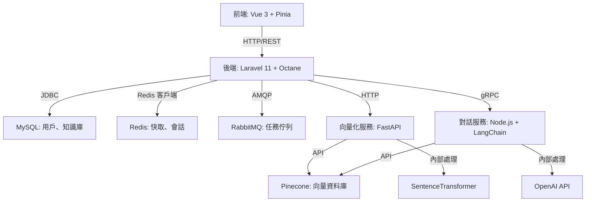

# AIStackForge

AIStackForge 是一個高效能的全棧應用程式骨架，結合 Laravel 11、Vue 3 和模組化微服務，專為 AI 功能整合、容器化部署和程式碼品質設計。專案提供核心程式碼和結構，適合快速開發和技術展示。

## 專案亮點

- **高效後端**：Laravel 11 搭配 Laravel Octane (Swoole)，支援 JWT 認證和 Redis 快取/會話，提供高性能 API。
- **模組化微服務**：
  - **向量化服務**：Python FastAPI 和 SentenceTransformer，將文件轉為向量並儲存至 Pinecone。
  - **對話服務**：Node.js 搭配 gRPC 和 LangChain JS，實現智慧對話功能。
- **現代前端**：Vue 3、Vite、Pinia 和 Tailwind CSS，打造快速且響應式的用戶介面。
- **容器化部署**：Docker 和 Kubernetes (Helm) 支援一鍵部署，包含水平自動擴展（HPA）。
- **CI/CD 整合**：GitHub Actions 自動化測試和構建，確保程式碼品質。
- **可觀測性**：Prometheus 指標收集，搭配 Nginx 和 PHP 的 liveness/readiness Probe，確保系統穩定。

## 程式架構圖

以下是專案架構圖，展示前端、後端與微服務的互動：



## 開始使用

### 1. 安裝 Laravel 基礎程式碼
專案僅提供核心程式碼，需自行安裝 Laravel 基礎結構：
```bash
composer create-project laravel/laravel . 11.*
composer require laravel/octane laravel/sanctum tymon/jwt-auth
php artisan octane:install --server=swoole
```

### 2. 環境設置
啟動 Docker 容器並配置環境：
```bash
./scripts/dev-setup.sh
```

### 3. 執行構建
構建前端和微服務：
```bash
./scripts/build.sh
```

### 4. 執行測試
執行後端和微服務測試：
```bash
./scripts/test.sh
```

### 5. 部署到 Kubernetes
使用 Helm 部署應用程式：
```bash
./scripts/deploy-helm.sh
```

## 環境變數
複製 `.env.example` 為 `.env`，並填入以下必要變數：
- `APP_KEY`：Laravel 應用程式金鑰
- `JWT_SECRET`：JWT 認證金鑰
- `PINECONE_API_KEY` 和 `PINECONE_ENVIRONMENT`：Pinecone 向量資料庫憑證
- `OPENAI_API_KEY`：OpenAI API 憑證

## 關鍵程式碼（帶中文註解）

以下選取核心程式碼，添加中文註解以展示主要功能：

### 1. 後端：用戶認證控制器 (`app/Http/Controllers/AuthController.php`)
```php
<?php

namespace App\Http\Controllers;

use App\Models\User;
use Illuminate\Http\Request;
use Tymon\JWTAuth\Facades\JWTAuth;

class AuthController extends Controller
{
    // 用戶註冊功能
    public function register(Request $request)
    {
        // 驗證輸入並創建新用戶，密碼使用 bcrypt 加密，與 config/hashing.php 配置一致
        $user = User::create([
            'name' => $request->name,
            'email' => $request->email,
            'password' => bcrypt($request->password),
        ]);

        // 生成 JWT Token 用於後續認證
        $token = JWTAuth::fromUser($user);
        return response()->json(compact('user', 'token'));
    }

    // 用戶登入功能
    public function login(Request $request)
    {
        // 獲取用戶輸入的電子郵件和密碼
        $credentials = $request->only('email', 'password');
        
        // 驗證憑證，若失敗則返回 401 未授權錯誤
        if (!$token = JWTAuth::attempt($credentials)) {
            return response()->json(['error' => 'Unauthorized'], 401);
        }

        return $this->respondWithToken($token);
    }

    // 返回格式化的 JWT Token 響應，包含 Token 和有效期限
    protected function respondWithToken($token)
    {
        return response()->json([
            'access_token' => $token,
            'token_type' => 'bearer',
            'expires_in' => JWTAuth::factory()->getTtl() * 60
        ]);
    }
}
```

### 2. 微服務：向量化服務 (`microservices/vectorization-service/app/main.py`)
```python
from fastapi import FastAPI, HTTPException
from pydantic import BaseModel
import os
from pinecone import Pinecone
from sentence_transformers import SentenceTransformer

# 初始化 FastAPI 應用
app = FastAPI()

# 初始化 Pinecone 向量資料庫，使用環境變數中的 API 憑證
pinecone = Pinecone(api_key=os.environ.get('PINECONE_API_KEY'), environment=os.environ.get('PINECONE_ENVIRONMENT'))
index = pinecone.Index('my-index')

# 初始化 SentenceTransformer 模型，用於生成文件向量
model = SentenceTransformer('all-MiniLM-L6-v2')

# 定義請求數據結構，包含文件 ID 和內容
class Document(BaseModel):
    document_id: int
    content: str

# 向量化文件並儲存至 Pinecone
@app.post("/vectorize")
async def vectorize_document(doc: Document):
    try:
        # 使用模型將文件內容轉為向量表示
        vector = model.encode(doc.content).tolist()
        # 將向量上傳至 Pinecone，包含文件 ID 和元數據
        index.upsert(vectors=[
            {'id': str(doc.document_id), 'values': vector, 'metadata': {'content': doc.content}}
        ])
        return {"message": "已成功上傳至 Pinecone"}
    except Exception as e:
        # 處理異常並返回 500 錯誤
        raise HTTPException(status_code=500, detail=str(e))
```

### 3. 前端：認證狀態管理 (`resources/js/stores/auth.js`)
```javascript
import { defineStore } from 'pinia';

// 定義 Pinia 狀態管理 store，用於管理用戶認證狀態
export const useAuthStore = defineStore('auth', {
  // 狀態：從 localStorage 獲取或初始化 JWT Token
  state: () => ({
    token: localStorage.getItem('token') || null,
  }),
  // 計算屬性：檢查用戶是否已認證
  getters: {
    isAuthenticated: (state) => !!state.token,
  },
  // 操作：設定或清除認證 Token
  actions: {
    setToken(token) {
      this.token = token;
      localStorage.setItem('token', token); // 儲存 Token 至 localStorage
    },
    clearToken() {
      this.token = null;
      localStorage.removeItem('token'); // 清除 Token
    },
  },
});
```

## 開發注意事項

- **Laravel 安裝**：專案僅提供核心程式碼，需自行安裝 Laravel 基礎結構（如 `composer create-project laravel/laravel`）。
- **環境變數**：確保 `.env` 檔案中已正確配置 `APP_KEY`、`JWT_SECRET`、`PINECONE_API_KEY`、`PINECONE_ENVIRONMENT` 和 `OPENAI_API_KEY`。
- **Docker 環境**：執行 `docker-compose.yml` 前，確認已安裝 Docker 和 Docker Compose。
- **Kubernetes 部署**：使用 Helm 部署前，確保 Kubernetes 集群已設置並安裝 Helm。
- **程式碼品質**：執行 `./scripts/lint.sh` 檢查程式碼風格，確保一致性。
- **監控**：檢查 `docker/prometheus/prometheus.yml` 配置，確保 Prometheus 指標收集正常。

## 聯繫方式
如有問題，請提交 GitHub Issue 或聯繫專案維護者。
